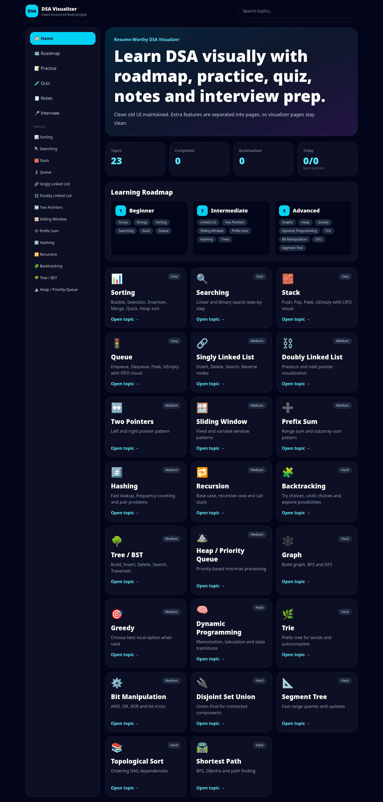
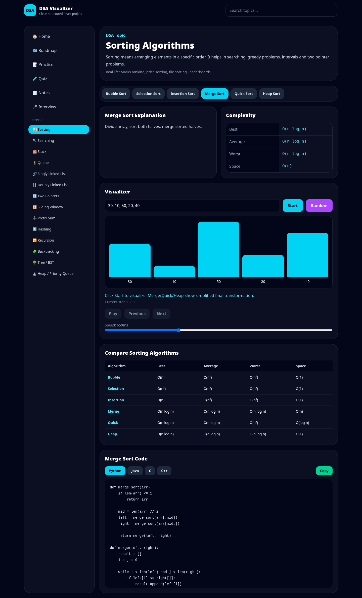
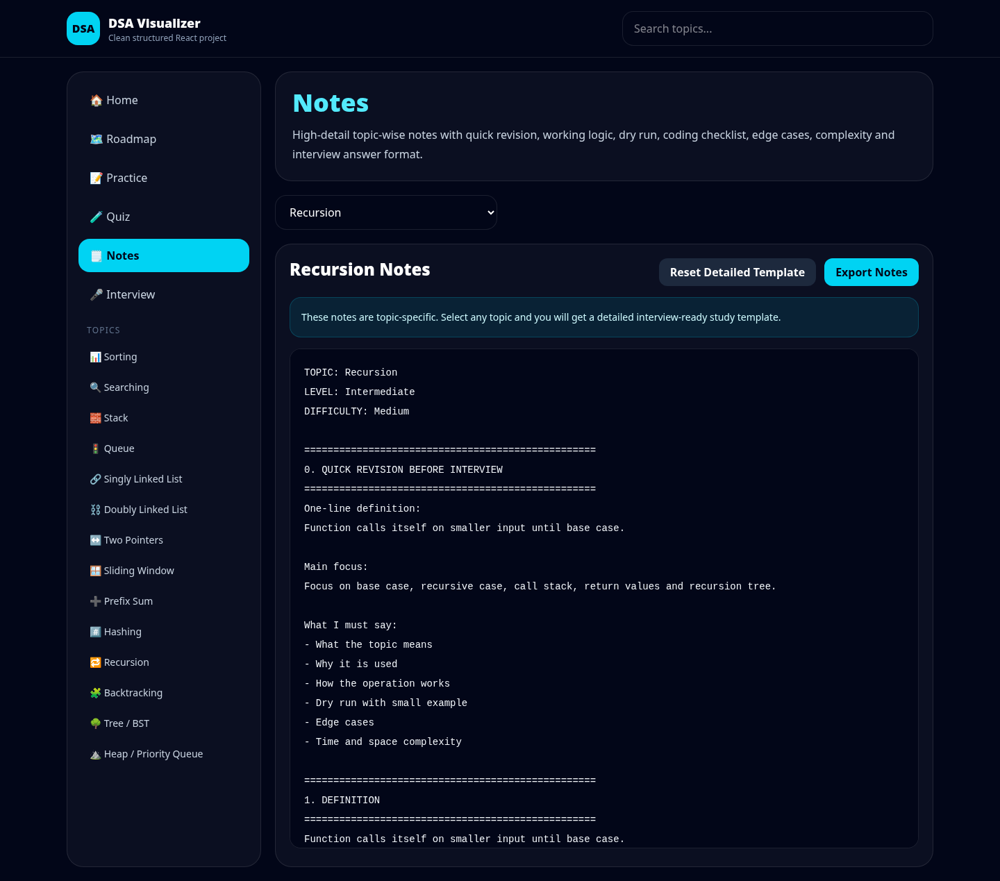
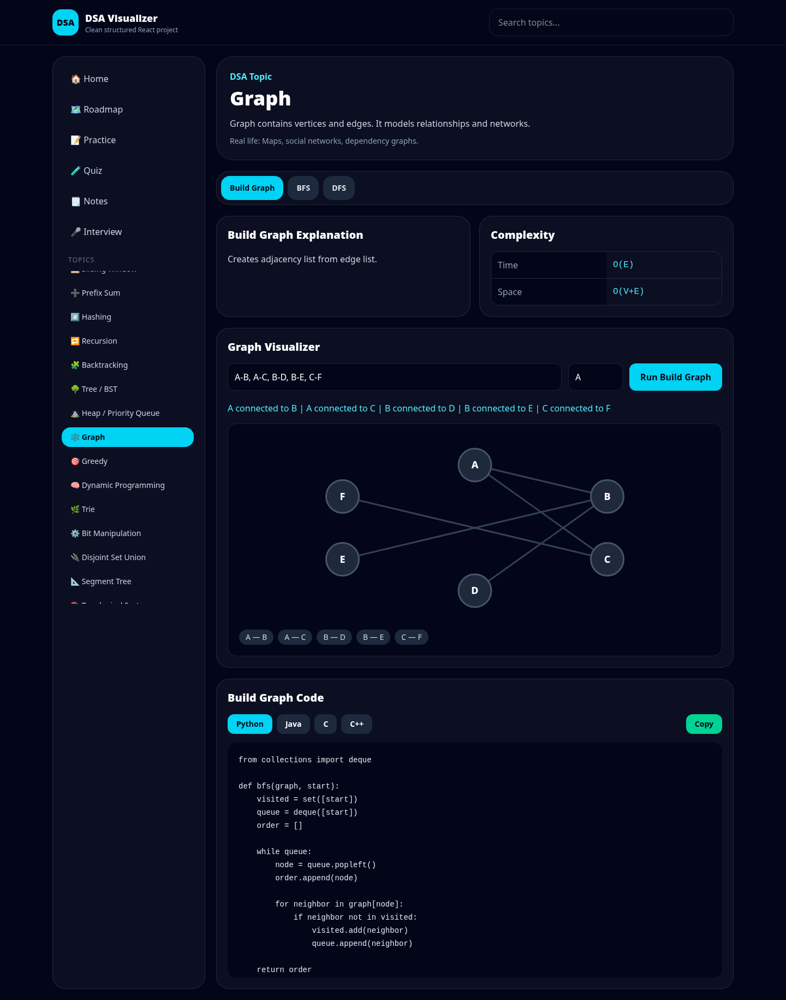

# DSA Visualizer

A beginner-friendly Data Structures and Algorithms visualizer built using React and Tailwind CSS.

## Live Demo

https://dsa-visualizer-six-cyan.vercel.app/

## Features

- Interactive DSA visualizers
- Topic-wise explanations
- Operation-wise complexity
- Code examples in Python, Java, C, and C++
- Copy code option
- Clean beginner-friendly UI

- ## Screenshots

### Home Page

### Sorting Visualizer

### Notes Section

### Interview Prep

### Graph Visualizer

## Topics Included

- Sorting Algorithms
- Searching Algorithms
- Stack
- Queue
- Singly Linked List
- Doubly Linked List
- Two Pointers
- Sliding Window
- Tree / Binary Search Tree
- Graph BFS and DFS

## Tech Stack

- React
- Vite
- Tailwind CSS
- JavaScript
- Vercel

## Purpose

This project helps students understand DSA concepts visually instead of only reading theory.

## Author

Anudeep
